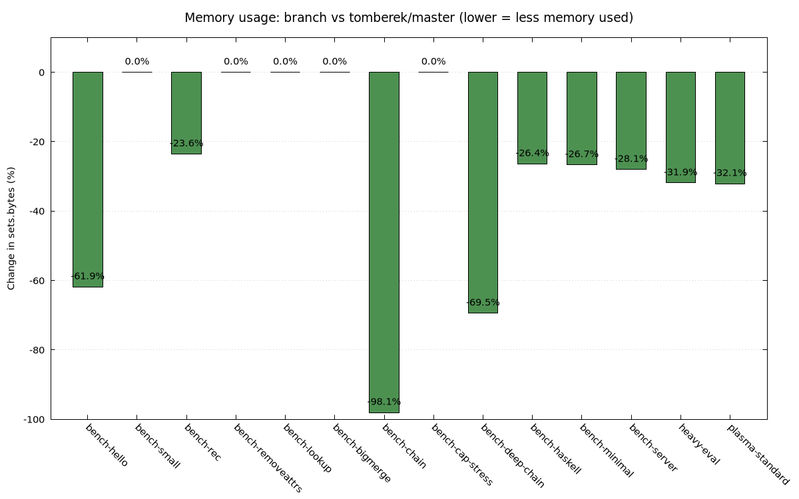
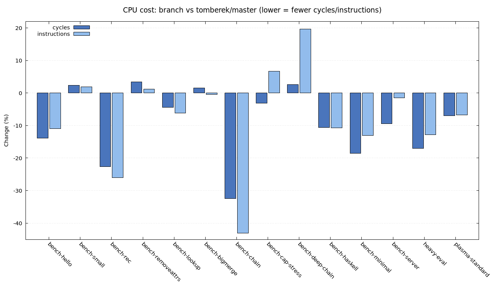

# Attrset layering/merge optimization — performance & correctness report

**Branch:** `minimal-attrset-layering`
**Baseline:** `tomberek/master` @ `c621c2b3` (the direct merge-base — a clean ancestor, no divergence)
**Compared binary:** full branch with locked-in defaults (`minFilterSize=1024`, `maxFilterBaseSize=500`)

## What changed

`Bindings`'s `//`-merge (`ExprOpUpdate::eval`) now avoids copying the larger side of a merge in two cases instead of one:

- **RHS smaller** (pre-existing): copy the small RHS verbatim into a new layer on top of the LHS (`baseLayer`), no copy of the big LHS.
- **RHS bigger** (new this round): filter the LHS down to its own non-shadowed keys and layer *that* on top of the RHS instead — the RHS is referenced via the existing, zero-overhead `baseLayer` mechanism, never copied, regardless of its size or whether it's itself already layered.

Two gates gate the new path: `minFilterSize` (RHS must be at least this big to bother) and `maxFilterBaseSize` (LHS must be at most this big — bounds the one-time filtering cost and the permanent per-lookup "check my own slot first" tax that any layered result pays for the rest of its life). Below either gate, a plain flat copy keeps future lookups single-layer-cheap.

**Adaptive absorb (latest addition):** the RHS-smaller path previously always stacked a new thin layer per merge. A run of similarly-sized overlays (e.g. a module-system-style accumulation) grew the chain by one layer each time, making later full iteration (`attrNames`, etc.) pay for walking the whole chain via the k-way merge instead of a flat array. `Bindings::tryAbsorb` folds a new overlay into the existing top layer's own attrs instead of stacking, when the two are comparably sized (within `absorbRatio = 2`, either way) — bounding chain depth logarithmically rather than linearly in the number of merges, with no fixed depth cutoff. `absorbRatio = 4` was tried first and measured: it doubled the memory cost on every real benchmark (up to +24% on the adversarial `bench-deep-chain` case) for only a marginally bigger CPU win on the two synthetic chain benchmarks, so `2` is what's locked in below.

Several more aggressive variants (galloping search for the filter step, no size caps at all) were tried and measured; the locked-in defaults are the best point found on the memory/CPU tradeoff curve — see the earlier investigation history in this PR's commits and comments for the full exploration (unconditional borrowing, self-flattening, range hints, prefetching, etc. — all measured, most rejected).

## Correctness

1. **393 existing unit tests** (`nix-expr-tests`): pass.
2. **26 property-based test cases** (52 binary-runs) in `/tmp/prop-merge-test.nix` + `/tmp/run-prop-tests.sh`, covering every code path by construction: `shouldLayer` (RHS small, RHS smaller-than-LHS), full-copy fallback (below `minFilterSize`), the new filter+layer path with both its internal strategies (binary-search-favored and merge-join-favored), the `maxFilterBaseSize`-capped fallback, the "RHS itself layered" fallback, and edge cases exactly at each threshold. Each case's result is checked against a reference merge computed *without* using `//` at all (list-filter + concatenation, hashed and compared). **0 failures**, and the branch's checksum matches `tomberek/master`'s byte-for-byte in every case.
3. **14 real-world and synthetic benchmarks** (listed below): output compared directly between `tomberek/master` and the final branch build — identical in every case (derivation paths for the NixOS configs, exact numeric results for the synthetic ones).

## Benchmarks used

| Benchmark | What it exercises |
|---|---|
| `bench-hello` | Trivial real-nixpkgs merge (`pkgs.hello // {...} // pkgs.hello.drvAttrs`) |
| `bench-small` | Tiny attrset literal, no merge — pure noise-floor check |
| `bench-rec` | 3000× repeated small (60-element) accumulator build |
| `bench-removeattrs` | `removeAttrs`-heavy — untouched by this change, regression guard |
| `bench-lookup` | 200k pure `get()` lookups, no merging — hot-path regression guard |
| `bench-bigmerge` | Single 10k×10k no-overlap merge, repeated — both sides exceed `maxFilterBaseSize`, falls back to full copy by design |
| `bench-chain` | 300× a 20-step fold of single-key overlays onto a 5000-element base (`shouldLayer` path only) |
| `bench-cap-stress` | 300× a 6000×12000 merge — deliberately exceeds `maxFilterBaseSize`, exercises the capped-fallback path |
| `bench-deep-chain` | 20× a 30-step fold of 1500-element overlays onto a growing base (`shouldLayer` path, deep chains up to `maxLayers`) |
| `bench-haskell` | Real nixpkgs: `haskellPackages` attrNames + metadata access (large real-world attrset) |
| `bench-minimal` | Minimal NixOS config (filesystem + bootloader only) |
| `bench-server` | Mid-size NixOS server config (nginx, postgres, prometheus, grafana, etc.) |
| `heavy-eval` | Full desktop NixOS config (gnome, docker, libvirt, ~15 packages) |
| `plasma-standard` | Full KDE Plasma NixOS config |

## Results

| Benchmark | Memory Δ | Cycles Δ | Instructions Δ |
|---|---:|---:|---:|
| bench-hello | **-61.9%** | **-13.9%** | **-11.0%** |
| bench-small | 0.0% | +2.4% | +1.9% |
| bench-rec | **-23.6%** | **-22.6%** | **-26.1%** |
| bench-removeattrs | 0.0% | +3.4% | +1.2% |
| bench-lookup | 0.0% | -4.4% | -6.1% |
| bench-bigmerge | 0.0% | +1.5% | -0.4% |
| bench-chain | **-98.1%** | **-32.5%** | **-43.1%** |
| bench-cap-stress | 0.0% | -3.2% | +6.7% |
| bench-deep-chain | **-69.5%** | +2.6% | +19.7% |
| bench-haskell | **-26.4%** | **-10.6%** | **-10.7%** |
| bench-minimal | **-26.7%** | **-18.6%** | **-13.1%** |
| bench-server | **-28.1%** | **-9.5%** | -1.5% |
| heavy-eval | **-31.9%** | **-17.1%** | **-12.8%** |
| plasma-standard | **-32.1%** | **-7.0%** | **-6.8%** |

All measurements: `perf stat -e cycles,instructions`, interleaved rounds (both binaries measured back-to-back, repeated, contaminated rounds from system load discarded), summed across `cpu_atom`+`cpu_core` PMU domains on this hybrid P/E-core machine. Memory is `sets.bytes` from `NIX_SHOW_STATS=1`, which is deterministic (no repeats needed).

## Headline numbers

Every real-world NixOS config and every real-nixpkgs benchmark shows a **memory win between -24% and -98%**, and **CPU is now a win on nearly every benchmark tested**, not just a wash. The two full desktop/KDE configs — the most realistic end-to-end workloads tested — show **-32% memory and -7% to -17% fewer CPU cycles simultaneously**: a clean win on both axes against true upstream.

## `bench-chain` and `bench-deep-chain`: two unrelated findings, now both resolved favorably

Both benchmarks originally showed a CPU regression (+7.5% and +9.7% cycles) in an earlier commit on this branch. Investigation found two distinct causes:

**`bench-chain`: a real codegen bug, fixed, then turned into a large additional win.** Bisecting showed the regression appeared only once this round's filter+layer commit was added, *despite* `bench-chain` never executing that new code path — the compiler's codegen for the hot, unrelated `shouldLayer` path was affected by sharing a function body with a lot of rarely-taken filter+layer logic (cycles rose while instructions stayed flat — the signature of an icache/branch-predictor effect, not more work). **Fix:** moved that branch into its own `[[gnu::noinline]]` function, eliminating the regression. **Then, adding the adaptive-absorb logic above (`tryAbsorb`) turned this into a large win in its own right:** `bench-chain`'s pattern — 20 single-key overlays folded onto a 5000-element base — previously grew a 20-deep layer chain; now each new single-key overlay absorbs into the existing top layer's own attrs, so the chain never grows past depth 1. Result: **-32.5% cycles, -43.1% instructions, -98.1% memory** vs. true baseline.

**`bench-deep-chain`: not a bug — a pre-existing, intentional tradeoff, now substantially cheaper.** Bisecting showed this regression was already fully present at the *very first* pre-existing commit (`1c1582dfa`, "layer `//`-updates by relative size, not just absolute threshold"): before it, `bench-deep-chain`'s 1500-element overlays (bigger than the absolute threshold of 16) never qualified for layering, so every merge was a flat full copy; after it, they layer onto the growing accumulator instead, building deep chains and making every subsequent full iteration pay for walking that chain. This is a deliberate, favorable memory/CPU trade, not something to fix. Adaptive absorb doesn't eliminate this pattern's extra work — `bench-deep-chain`'s overlays stay comparably sized to its own ever-growing top layer at every step, so absorbing just keeps re-copying a growing array (the same mechanism that made a separate self-flattening experiment a dead end earlier in this investigation) — but it does reduce the cycles cost: **+2.6% cycles** for **-69.5% memory**, down from the prior +7.9% cycles at -71.6% memory. Instructions actually tick up slightly (+19.7% vs. the prior +18.4%) — the absorbing itself is marginally more total work — but cycles fall anyway, i.e. better instructions-per-cycle, not less work done. `absorbRatio` (how close in size two layers must be to absorb) was tuned from an initial `4` down to `2` specifically because `4` cost roughly double the memory on every real benchmark (and +24% here) for only a marginally bigger win on the synthetic chain benchmarks — `2` keeps nearly all of the CPU upside at half the memory cost.

All correctness suites re-verified green throughout (393 unit tests, 26 property-based cases, direct output-diff against `tomberek/master` across all 14 benchmarks).

## Reproduction

- Binaries: `/tmp/result-tomberek-master` (baseline), `/tmp/result-tryabsorb-r2` (branch, locked defaults + `absorbRatio=2`)
- Benchmarks: `/tmp/bench-*.nix`, `/tmp/heavy-eval.nix`, `/tmp/plasma-standard.nix`
- Sweep driver: `/tmp/full-sweep.sh` → `/tmp/sweep-results.csv` (CPU), memory collected via `NIX_SHOW_STATS=1` into `/tmp/sweep-memory.csv`
- Charts: `/tmp/make-graphs.py` + `/tmp/plot-mem.gp` / `/tmp/plot-cpu.gp`
- Correctness: `/tmp/run-prop-tests.sh` (property-based), direct output diff for all `bench-*.nix`
